# AgentGate Architecture

> **Production-Grade AI Agent Governance Platform**
>
> Version 1.0.0 | Last Updated: February 2026

---

## Table of Contents

1. [Executive Summary](#1-executive-summary)
2. [System Architecture](#2-system-architecture)
3. [Core SDK Architecture](#3-core-sdk-architecture)
4. [Server Architecture](#4-server-architecture)
5. [Dashboard Architecture](#5-dashboard-architecture)
6. [Security Architecture](#6-security-architecture)
7. [Data Flow Patterns](#7-data-flow-patterns)
8. [Compliance & Audit](#8-compliance--audit)
9. [Performance & Scalability](#9-performance--scalability)
10. [Deployment Architecture](#10-deployment-architecture)

---

## 1. Executive Summary

AgentGate is an enterprise-grade governance gateway for AI agents, implementing a Defense-in-Depth security model across three architectural layers:

| Layer | Technology | Purpose |
|-------|------------|---------|
| **SDK (Data Plane)** | Python 3.13+ | Runtime agent integration, middleware execution |
| **Server (Control Plane)** | FastAPI + PostgreSQL | Policy enforcement, threat detection, audit trails |
| **Dashboard (Observability Plane)** | Next.js 14 + React Query | Real-time monitoring, approval workflows, analytics |

### Key Architectural Decisions

| Decision | Rationale |
|----------|-----------|
| **Middleware Chain Pattern** | Composable, ordered execution of security controls |
| **Bidirectional PII Anonymization** | Data never leaves security boundary unprotected |
| **HMAC-SHA256 Audit Chains** | Tamper-evident, blockchain-lite integrity verification |
| **Async-First Design** | Non-blocking I/O for high-throughput agent workloads |
| **RBAC with Minimum Privilege** | Granular 21-permission matrix across 5 roles |

---

## 2. System Architecture

### 2.1 High-Level Architecture

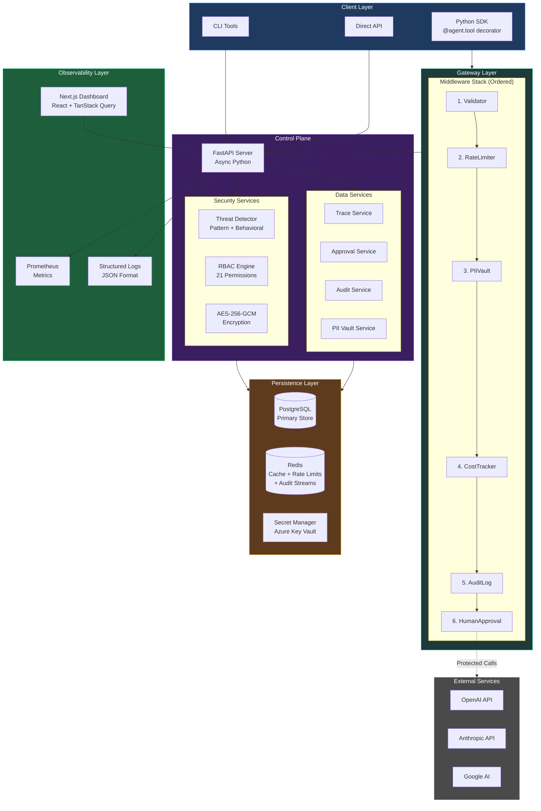

### 2.2 Request Lifecycle

```mermaid
sequenceDiagram
    autonumber
    participant Agent as AI Agent
    participant SDK as AgentGate SDK
    participant MW as Middleware Chain
    participant API as FastAPI Server
    participant DB as PostgreSQL
    participant LLM as LLM Provider

    Agent->>SDK: agent.call("tool", inputs)

    Note over SDK: Create Trace (PENDING)
    SDK->>SDK: trace.start()

    rect rgb(30, 58, 95)
        Note over MW: Middleware Pipeline
        SDK->>MW: before() hooks
        MW->>MW: 1. Validator.before()
        MW->>MW: 2. RateLimiter.before()
        MW->>MW: 3. PIIVault.before()
        Note over MW: PII detected → mask
        MW->>MW: 4. CostTracker.before()
        MW->>MW: 5. AuditLog.before()
        MW->>MW: 6. HumanApproval.before()
    end

    alt Approval Required
        MW->>API: POST /approvals
        API->>DB: Store approval request
        API-->>MW: approval_id
        MW-->>Agent: ApprovalRequired exception
    else Approved/No Approval Needed
        MW->>LLM: Execute with masked PII
        LLM-->>MW: Response

        rect rgb(30, 95, 58)
            Note over MW: Reverse Pipeline
            MW->>MW: 6. HumanApproval.after()
            MW->>MW: 5. AuditLog.after()
            Note over MW: Log execution
            MW->>MW: 4. CostTracker.after()
            Note over MW: Record cost
            MW->>MW: 3. PIIVault.after()
            Note over MW: Rehydrate PII
            MW->>MW: 2. RateLimiter.after()
            MW->>MW: 1. Validator.after()
        end

        MW-->>SDK: Result
        SDK->>SDK: trace.succeed(result)
        SDK-->>Agent: Return result
    end
```

---

## 3. Core SDK Architecture

### 3.1 Module Structure

```
ea_agentgate/
├── agent.py              # Core Agent class, tool registration
├── client.py             # UniversalClient with multi-provider routing
├── trace.py              # Execution tracing with timing
├── exceptions.py         # Typed exception hierarchy
│
├── middleware/
│   ├── base.py           # MiddlewareChain, Context
│   ├── validator.py      # Security validation (SQLi, XSS, etc.)
│   ├── rate_limiter.py   # Sliding window rate limiting
│   ├── pii_vault.py      # PII detection and masking
│   ├── cost_tracker.py   # Budget enforcement
│   ├── audit_log.py      # Immutable audit trails
│   ├── semantic_cache.py # Embedding-based caching
│   ├── guardrail.py      # State machine enforcement
│   └── approval.py       # Human-in-the-loop
│
├── providers/
│   ├── base.py           # LLMProvider protocol
│   ├── openai_provider.py
│   ├── anthropic_provider.py
│   ├── google_provider.py
│   ├── registry.py       # Provider registration
│   ├── health.py         # Circuit breaker pattern
│   └── routing.py        # Selection strategies
│
├── backends/
│   ├── protocols.py      # Backend interfaces
│   ├── memory.py         # In-memory implementations
│   └── redis.py          # Distributed implementations
│
└── security/
    ├── encryption.py     # AES-256-GCM encryption
    ├── integrity.py      # HMAC-SHA256 chains
    ├── access_control.py # RBAC utilities
    └── policy.py         # Policy definitions
```

### 3.2 Agent Class Architecture

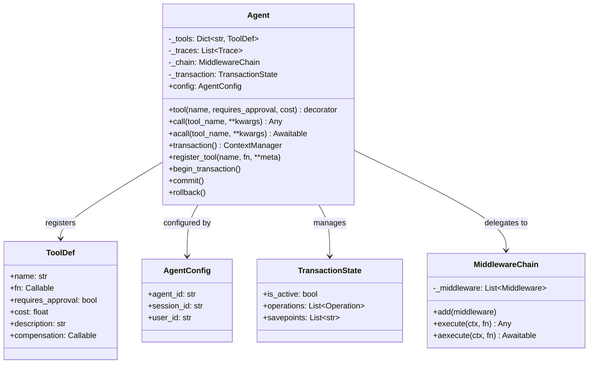

**Key Implementation Details:**

| Method | Location | Purpose |
|--------|----------|---------|
| `tool()` | `agent.py:148-188` | Decorator for registering functions as governed tools |
| `call()` | `agent.py:204-285` | Synchronous execution with full middleware chain |
| `acall()` | `agent.py:443-513` | Async execution with proper event loop handling |
| `transaction()` | `agent.py:287-343` | ACID-like operations with compensation rollback |

### 3.3 Middleware Architecture

```mermaid
flowchart LR
    subgraph MiddlewareChain
        direction TB

        subgraph BeforePhase["before() Phase"]
            B1["Validator<br/>Security checks"]
            B2["RateLimiter<br/>Throttling"]
            B3["PIIVault<br/>Mask PII"]
            B4["CostTracker<br/>Budget check"]
            B5["AuditLog<br/>Start logging"]
            B6["HumanApproval<br/>Check approval"]
        end

        subgraph Execution["Tool Execution"]
            FN["wrapped_fn()"]
        end

        subgraph AfterPhase["after() Phase (Reverse)"]
            A6["HumanApproval<br/>Record decision"]
            A5["AuditLog<br/>Complete log"]
            A4["CostTracker<br/>Record cost"]
            A3["PIIVault<br/>Rehydrate PII"]
            A2["RateLimiter<br/>Update counters"]
            A1["Validator<br/>Output validation"]
        end
    end

    B1 --> B2 --> B3 --> B4 --> B5 --> B6
    B6 --> FN
    FN --> A6 --> A5 --> A4 --> A3 --> A2 --> A1

    style BeforePhase fill:#1e3a5f,stroke:#60a5fa
    style Execution fill:#1e5f3b,stroke:#34d399
    style AfterPhase fill:#5f1e3a,stroke:#f87171
```

**Middleware Implementations:**

| Middleware | File | Key Features |
|------------|------|--------------|
| **Validator** | `validator.py` | SQLi/XSS/Path traversal detection, URL decoding, path canonicalization |
| **RateLimiter** | `rate_limiter.py` | Sliding window algorithm, Redis Lua atomicity, multi-scope (global/user/session) |
| **PIIVault** | `pii_vault.py` | Presidio NLP detection, bidirectional masking, session-scoped storage |
| **CostTracker** | `cost_tracker.py` | Pre-call estimation, per-call limits, budget enforcement |
| **AuditLog** | `audit_log.py` | Multi-destination (file/callback/stdout), JSON Lines, key redaction |
| **SemanticCache** | `semantic_cache.py` | Cosine similarity (0.95 threshold), TTL expiration, tool-specific rules |
| **StatefulGuardrail** | `guardrail.py` | FSM enforcement, cooldown windows, frequency limits |
| **HumanApproval** | `approval.py` | Wildcard patterns, sync handlers, webhook mode, timeout support |

### 3.4 Provider System

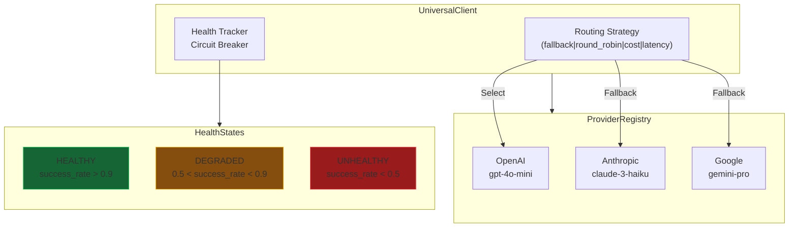

**Routing Strategies:**

| Strategy | Algorithm | Use Case |
|----------|-----------|----------|
| `fallback` | Try providers in order until success | High availability |
| `round_robin` | Distribute load across providers | Load balancing |
| `cost` | Select cheapest provider | Cost optimization |
| `latency` | Select fastest (historical p50) | Performance critical |
| `random` | Random selection | Testing/chaos engineering |

---

## 4. Server Architecture

### 4.1 FastAPI Application Structure

```
server/
├── main.py               # App factory, lifespan, middleware stack
├── config.py             # Pydantic Settings, Azure Key Vault
│
├── routers/
│   ├── auth.py           # Login, register, MFA, JWT refresh
│   ├── passkey.py        # WebAuthn (FIDO2) authentication
│   ├── traces.py         # Execution history
│   ├── approvals.py      # Human-in-the-loop
│   ├── costs.py          # Budget analytics
│   ├── audit.py          # Immutable logs, export
│   ├── pii.py            # Encrypted vault operations
│   ├── security.py       # Threat management
│   ├── users.py          # User administration
│   ├── datasets.py       # Test dataset management
│   └── settings.py       # System configuration
│
├── models/
│   ├── database.py       # AsyncPG connection, pooling
│   ├── user_schemas.py   # User, Session, Role models
│   ├── trace_schemas.py  # Trace, TraceStatus
│   ├── approval_schemas.py
│   ├── audit_schemas.py
│   └── pii_schemas.py    # Vault, Classification, Audit
│
├── audit/
│   ├── __init__.py           # Lazy-loaded re-exports
│   ├── config.py             # Pipeline mode enum, stream keys
│   ├── bus.py                # EventBus protocol, Sync/Redis impls
│   └── consumer.py           # Redis Stream background consumer
│
├── security/
│   ├── threat_detector.py    # Real-time IDS
│   ├── threat_patterns.py    # Attack signatures
│   └── rate_limiting.py      # SlowAPI integration
│
└── middleware/
    ├── security_headers.py   # OWASP headers
    └── threat_detection.py   # Request analysis
```

### 4.2 Server Middleware Stack

```mermaid
flowchart TB
    subgraph Request["Incoming Request"]
        REQ["HTTP Request"]
    end

    subgraph MiddlewareStack["Server Middleware (Order Matters)"]
        direction TB
        M1["1. CORS Middleware<br/>Origin validation"]
        M2["2. Security Headers<br/>OWASP compliance"]
        M3["3. Threat Detection<br/>Pattern + behavioral"]
        M4["4. Rate Limiting<br/>SlowAPI + Redis"]
        M5["5. Metrics Middleware<br/>Prometheus counters"]
    end

    subgraph Router["FastAPI Router"]
        AUTH["Auth Router<br/>/api/auth/*"]
        DATASETS["Datasets Router<br/>/api/datasets/*"]
        APPROVALS["Approvals Router<br/>/api/approvals/*"]
        OTHER["Other Routers..."]
    end

    subgraph Response["Response"]
        RES["HTTP Response"]
    end

    REQ --> M1 --> M2 --> M3 --> M4 --> M5
    M5 --> AUTH & DATASETS & APPROVALS & OTHER
    AUTH & DATASETS & APPROVALS & OTHER --> RES

    style MiddlewareStack fill:#3b1e5f,stroke:#a78bfa
```

**Security Headers Applied:**

| Header | Value | Purpose |
|--------|-------|---------|
| `Strict-Transport-Security` | `max-age=31536000; includeSubDomains` | Force HTTPS |
| `X-Frame-Options` | `DENY` | Clickjacking prevention |
| `X-Content-Type-Options` | `nosniff` | MIME sniffing prevention |
| `Content-Security-Policy` | Dynamic per endpoint | XSS prevention |
| `Permissions-Policy` | `geolocation=(), microphone=(), camera=()` | Feature restriction |

### 4.3 API Endpoint Matrix

| Router | Endpoint | Method | Auth | Rate Limit | Purpose |
|--------|----------|--------|------|------------|---------|
| **Auth** | `/api/auth/login` | POST | None | 5/min | Credential authentication |
| | `/api/auth/register` | POST | None | 5/min | User registration |
| | `/api/auth/refresh` | POST | None | 10/min | JWT token refresh |
| | `/api/auth/enable-2fa` | POST | Bearer | 10/min | Initialize TOTP MFA |
| **Passkey** | `/api/auth/passkey/register-start` | POST | Bearer | 10/min | Begin WebAuthn registration |
| | `/api/auth/passkey/login-finish` | POST | None | 10/min | Complete WebAuthn authentication |
| | `/api/auth/passkey/list` | GET | Bearer | 100/min | List registered passkeys |
| **Datasets** | `/api/datasets` | GET | Bearer | 100/min | List datasets |
| | `/api/datasets/{dataset_id}/tests` | GET | Bearer | 100/min | List test cases |
| | `/api/datasets/{dataset_id}/runs` | POST | Bearer | 20/min | Start dataset test run |
| **Approvals** | `/api/approvals/pending` | GET | Bearer | 100/min | Pending approvals |
| | `/api/approvals/{approval_id}/decide` | POST | Bearer | 100/min | Approve/deny decision |
| **Audit** | `/api/audit` | GET | Bearer | 100/min | Filtered audit logs |
| | `/api/audit/export` | GET | Bearer | 10/min | CSV/JSON export |
| | `/api/pii/audit/verify-chain` | GET | Bearer | 100/min | PII audit integrity verification |
| **PII** | `/api/pii/detect` | POST | Bearer | 50/min | PII detection |
| | `/api/pii/redact` | POST | Bearer | 50/min | Redact PII and persist mapping |
| | `/api/pii/restore` | POST | Bearer | 50/min | Restore PII placeholders |
| **Security** | `/api/security/admissibility/evaluate` | POST | Bearer | 100/min | Runtime admissibility evaluation |
| | `/api/security/certificate/verify` | POST | Bearer | 100/min | Verify decision certificate |

### 4.4 Database Schema

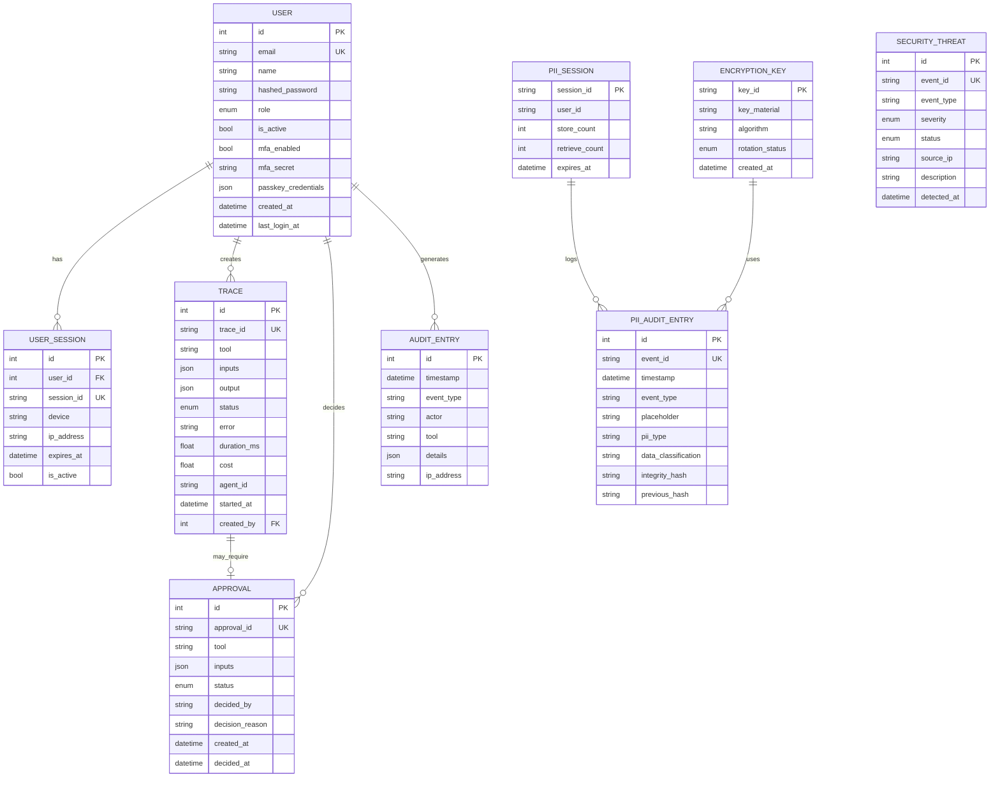

---

### 4.5 MCP Security Operations Layer

AgentGate exposes a dedicated MCP package at `server/mcp/` for conversational security operations.

**Design split:**
- **Mounted mode (`ENABLE_MCP=true`)**: SSE endpoint mounted at `/mcp/sse` for local MCP clients.
- **Standalone mode (`python -m server.mcp --http`)**: Streamable HTTP endpoint at `/mcp` for external MCP connectors (including OpenAI Responses MCP tools).

**Core MCP modules:**

| Module | Purpose |
|--------|---------|
| `server/mcp/server.py` | FastMCP server creation and registration |
| `server/mcp/resources.py` | Read-only threat/security resources |
| `server/mcp/tools_api.py` | API-backed MCP tool implementations |
| `server/mcp/tools_governance.py` | Natural-language policy parse/simulate/apply/unlock pipeline |
| `server/mcp/confirm.py` | Signed preview-token model for destructive operations |
| `server/mcp/auth_session.py` | JWT-aware auth session lifecycle helpers |

**Safety model:**
- Destructive tools are two-step (`confirm=False` preview, then `confirm=True` execution).
- Preview tokens are HMAC-signed, TTL-bound, and parameter-bound.

## 5. Dashboard Architecture

### 5.1 Next.js App Router Structure

```
dashboard/src/
├── app/
│   ├── layout.tsx                 # Root layout with providers
│   ├── global-error.tsx           # Error boundary
│   │
│   ├── (auth)/
│   │   ├── login/page.tsx         # Authentication
│   │   └── signup/page.tsx        # Registration
│   │
│   └── (dashboard)/
│       ├── layout.tsx             # Sidebar, header, RBAC filtering
│       ├── page.tsx               # Overview dashboard
│       ├── playground/page.tsx    # Interactive demo
│       ├── traces/page.tsx        # Execution history
│       ├── approvals/page.tsx     # Approval queue
│       ├── costs/page.tsx         # Cost analytics
│       ├── audit/page.tsx         # Audit logs
│       ├── pii/page.tsx           # PII vault
│       ├── datasets/page.tsx      # Test management
│       ├── users/page.tsx         # User admin
│       ├── settings/page.tsx      # System config
│       └── security/
│           ├── settings/page.tsx  # Security config
│           └── threats/page.tsx   # Threat alerts
│
├── components/
│   ├── ui/                        # shadcn/ui primitives
│   │   ├── button.tsx
│   │   ├── card.tsx
│   │   ├── table.tsx
│   │   ├── badge.tsx
│   │   └── ...
│   ├── rbac/
│   │   ├── PermissionGate.tsx     # Conditional rendering
│   │   └── ProtectedButton.tsx    # Permission-aware buttons
│   └── providers.tsx              # Context providers
│
├── lib/
│   ├── auth.ts                    # NextAuth configuration
│   ├── hooks.ts                   # React Query hooks
│   ├── rbac.ts                    # Permission matrix
│   ├── theme.tsx                  # Theme provider
│   ├── api-wrapper.ts             # Error handling
│   └── api-schemas.ts             # Zod validation
│
└── types/
    └── index.ts                   # TypeScript interfaces
```

### 5.2 State Management Flow

```mermaid
flowchart TB
    subgraph Browser["Browser"]
        Component["React Component"]
        QueryHook["useQuery() / useMutation()"]
    end

    subgraph ReactQuery["TanStack React Query"]
        Cache["Query Cache<br/>staleTime: 30s-60s"]
        Mutations["Mutation Queue"]
        Invalidation["Cache Invalidation"]
    end

    subgraph NextAPI["Next.js API Routes"]
        Wrapper["apiWrapper()<br/>Error handling"]
        Schema["Zod Validation"]
        AuthHeader["getAuthHeaders()<br/>JWT injection"]
    end

    subgraph Backend["Python Backend"]
        FastAPI["FastAPI Server"]
    end

    Component --> QueryHook
    QueryHook --> Cache
    QueryHook --> Mutations

    Cache -->|"Cache Miss"| Wrapper
    Mutations --> Wrapper

    Wrapper --> Schema --> AuthHeader --> FastAPI

    FastAPI -->|"Response"| Cache
    Mutations -->|"onSuccess"| Invalidation
    Invalidation -->|"Refetch"| Cache

    style ReactQuery fill:#1e3a5f,stroke:#60a5fa
    style NextAPI fill:#1e5f3b,stroke:#34d399
```

**Cache Configuration:**

| Data Type | Stale Time | GC Time | Notes |
|-----------|-----------|---------|-------|
| Overview stats | 30s | 10min | Dashboard refresh |
| Traces | 30s | 10min | Frequent updates |
| Pending approvals | 0s | 0s | Always fresh |
| Costs | 60s | 10min | Less volatile |
| Audit logs | 30s | 10min | User-driven |

### 5.3 RBAC Permission Matrix

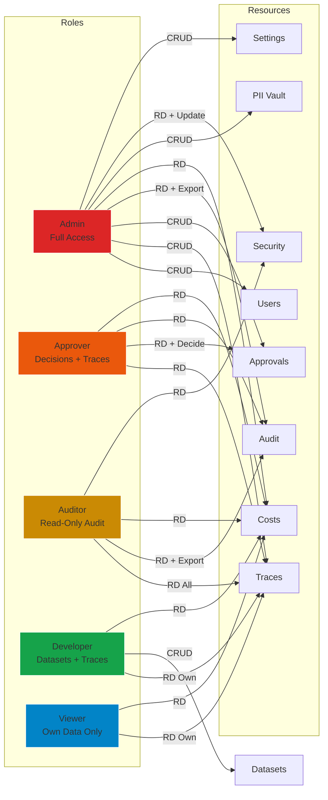

---

## 6. Security Architecture

### 6.1 Authentication Flow

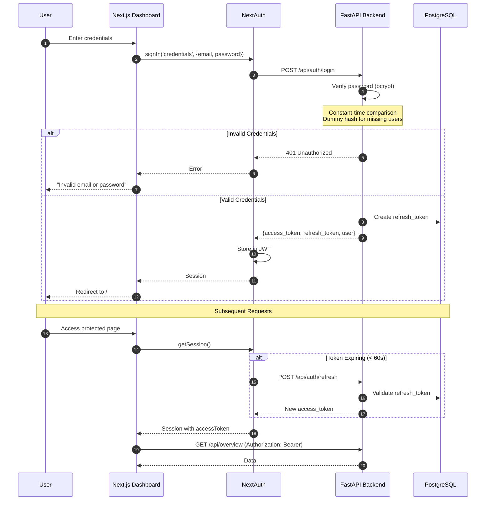

### 6.2 Threat Detection Pipeline

```mermaid
flowchart TB
    subgraph Request["Incoming Request"]
        HTTP["HTTP Request<br/>Method, Path, Headers, Body"]
    end

    subgraph PatternDetection["Pattern Detection"]
        direction TB
        SQLi["SQL Injection<br/>UNION, DROP, etc."]
        XSS["XSS Detection<br/>script, javascript:"]
        PathTrav["Path Traversal<br/>../../../etc"]
        CmdInj["Command Injection<br/>; rm -rf, | cat"]
        LDAP["LDAP Injection<br/>*)(uid="]
    end

    subgraph BehavioralAnalysis["Behavioral Analysis"]
        direction TB
        BruteForce["Brute Force<br/>10+ failed/hour"]
        RateAnomaly["Rate Anomaly<br/>100+ req/min"]
        DataExfil["Data Exfiltration<br/>Response > 10MB"]
        PrivEsc["Privilege Escalation<br/>Unauthorized role change"]
        GeoAnomaly["Geo Anomaly<br/>Unusual location"]
    end

    subgraph Response["Response Actions"]
        direction TB
        Allow["Allow<br/>Continue processing"]
        Log["Log<br/>Record threat event"]
        Block["Block<br/>Return 403/400"]
        IPBlock["IP Block<br/>Add to blocklist"]
    end

    HTTP --> PatternDetection
    HTTP --> BehavioralAnalysis

    PatternDetection -->|"No match"| Allow
    PatternDetection -->|"Match"| Log

    BehavioralAnalysis -->|"Normal"| Allow
    BehavioralAnalysis -->|"Suspicious"| Log
    BehavioralAnalysis -->|"Critical"| Block

    Log -->|"Severity: LOW/MEDIUM"| Allow
    Log -->|"Severity: HIGH"| Block
    Block -->|"Repeat offender"| IPBlock

    style PatternDetection fill:#1e3a5f,stroke:#60a5fa
    style BehavioralAnalysis fill:#5f1e3a,stroke:#f87171
    style Response fill:#1e5f3b,stroke:#34d399
```

**Detection Thresholds:**

| Threat Type | Threshold | Action |
|-------------|-----------|--------|
| Brute Force | 10 failed/hour | Alert |
| Brute Force | 20 failed/hour | Auto-block IP |
| Request Rate | 100/min | Alert |
| Response Size | 10MB | Alert |
| IP Block Duration | 1 hour | Auto-unblock |

### 6.3 Encryption Architecture

```mermaid
flowchart TB
    subgraph PIIFlow["PII Encryption Flow"]
        direction TB

        subgraph Input["Input"]
            RawPII["Raw PII<br/>'123-45-6789'"]
        end

        subgraph Encryption["Encryption (AES-256-GCM)"]
            Key["Active Key<br/>32 bytes"]
            Nonce["Random Nonce<br/>12 bytes (unique)"]

            Plaintext["Plaintext"]
            AESGCM["AES-GCM<br/>Encrypt"]
            Ciphertext["Ciphertext"]
            AuthTag["Auth Tag<br/>16 bytes"]
        end

        subgraph Output["Stored Format"]
            Format["version(1) | key_id(8) | nonce(12) | ciphertext | tag(16)"]
            B64["Base64 Encoded"]
        end
    end

    RawPII --> Plaintext
    Key --> AESGCM
    Nonce --> AESGCM
    Plaintext --> AESGCM
    AESGCM --> Ciphertext
    AESGCM --> AuthTag

    Ciphertext --> Format
    AuthTag --> Format
    Nonce --> Format
    Format --> B64

    style Encryption fill:#3b1e5f,stroke:#a78bfa
```

**Key Management:**

| Feature | Implementation |
|---------|----------------|
| Algorithm | AES-256-GCM (Authenticated Encryption) |
| Key Size | 256 bits (32 bytes) |
| Nonce | 96 bits (12 bytes), randomly generated per encryption |
| Auth Tag | 128 bits (16 bytes) |
| Key Derivation | PBKDF2-HMAC-SHA256, 100,000 iterations |
| Key Rotation | Supported via EncryptionKeyRing, key_id embedded in ciphertext |

---

## 7. Data Flow Patterns

### 7.1 PII Masking Flow

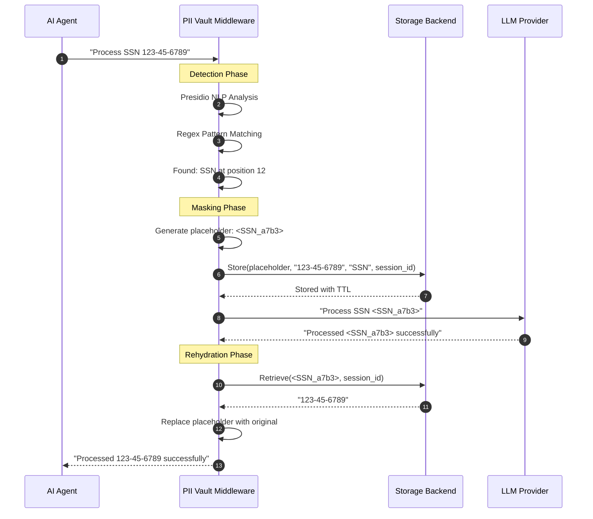

### 7.2 Approval Workflow

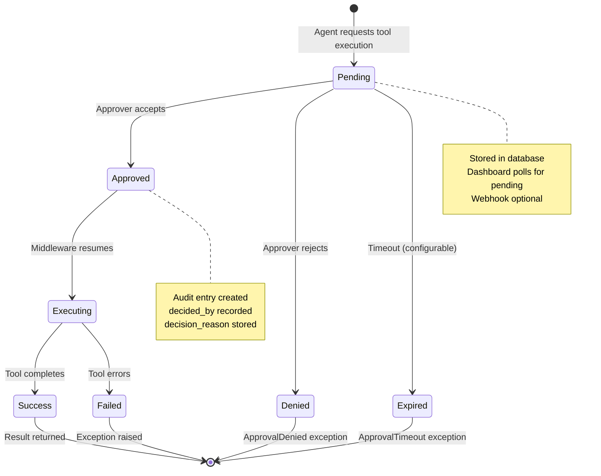

### 7.3 Audit Chain Verification

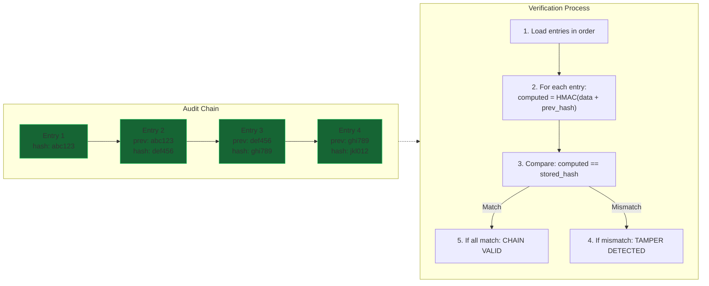

---

## 8. Compliance & Audit

### 8.1 Compliance Mapping

| Regulation | Requirement | AgentGate Implementation |
|------------|-------------|--------------------------|
| **HIPAA §164.312(a)(2)(iv)** | Encryption at rest | AES-256-GCM for PII vault |
| **HIPAA §164.312(b)** | Audit controls | PIIAuditEntry with integrity hashes |
| **HIPAA §164.312(c)(1)** | Integrity controls | HMAC-SHA256 chain of custody |
| **HIPAA §164.312(e)(1)** | Transmission security | TLS 1.3, HSTS headers |
| **SOC 2 CC6.1** | Logical access controls | RBAC with 21 permissions |
| **SOC 2 CC7.2** | System monitoring | Threat detection, metrics |
| **SOC 2 CC7.3** | Data integrity | Tamper-evident audit chain |
| **GDPR Article 17** | Right to erasure | Soft delete via `is_active` flag |
| **PCI-DSS 3.4** | Mask PAN when displayed | Credit card masking in PIIVault |
| **PCI-DSS 8.2** | Unique identification | User IDs, session IDs |

### 8.2 Audit Event Pipeline

Audit events are routed through an `EventBus` abstraction (`server/audit/bus.py`) that supports two modes, controlled by the `AUDIT_PIPELINE` environment variable:

| Mode | Value | Behavior | Latency Impact |
|------|-------|----------|----------------|
| **Synchronous** (default) | `sync` | `SyncEventBus` calls `session.add(AuditEntry(...))` within the request transaction. Identical to pre-pipeline behavior. | ~0 (in-transaction) |
| **Redis Stream** | `redis_stream` | `RedisStreamEventBus` publishes to a Redis Stream via `XADD` (microsecond operation). A background `StreamConsumer` reads batches and writes to PostgreSQL asynchronously. | Sub-millisecond publish |

All router callsites use a single entry-point `emit_audit_event()` which dispatches to the active bus. The bus is set during application startup in `server/lifespan.py`.

**Redis Stream architecture:**

```
Router ──XADD──▷ Redis Stream (agentgate:audit:events)
                          │
                  StreamConsumer (background task)
                          │
                 XREADGROUP (batch=50, block=2s)
                          │
                 ┌────────┴────────┐
                 │   Deserialize   │
                 └────────┬────────┘
                          │
                 ┌────────┴────────┐
                 │    DB commit    │──▷ XACK on success
                 └────────┬────────┘
                          │ (failure)
                 ┌────────┴────────┐
                 │      DLQ       │──▷ agentgate:audit:dlq
                 └─────────────────┘
```

**Fail-open design:** The `RedisStreamEventBus` catches all exceptions from `XADD` and logs them without propagating. Audit infrastructure failures never break request handling.

**Dead-letter queue:** Messages that fail deserialization or exceed `MAX_RETRIES` (5) deliveries are moved to `agentgate:audit:dlq` with the original payload and failure reason for manual inspection.

**Pending message recovery:** The consumer periodically runs `XPENDING` + `XCLAIM` to reclaim messages from crashed consumer instances after `CLAIM_IDLE_MS` (60 seconds).

### 8.3 Audit Event Types

| Event Type | Description | Data Captured |
|------------|-------------|---------------|
| `user.login` | User authentication | user_id, ip_address, success |
| `user.logout` | Session termination | user_id, session_id |
| `user.mfa_enabled` | MFA activation | user_id, method |
| `approval.decided` | Approval decision | approval_id, decided_by, decision |
| `pii.stored` | PII encrypted and stored | placeholder, pii_type, classification |
| `pii.retrieved` | PII decrypted and accessed | placeholder, user_id, purpose |
| `pii.deleted` | PII permanently removed | placeholder, user_id |
| `threat.detected` | Security threat identified | event_type, severity, source_ip |
| `threat.resolved` | Threat marked resolved | threat_id, resolved_by |
| `tool.executed` | Tool call completed | trace_id, tool, status, cost |
| `config.changed` | System setting modified | setting_key, old_value, new_value |

---

## 9. Performance & Scalability

### 9.1 Bottleneck Analysis

| Component | Potential Bottleneck | Mitigation |
|-----------|---------------------|------------|
| PII Detection | Presidio NLP model loading | Lazy loading, model caching |
| Pattern Matching | Regex on large request bodies | Max body size (1MB), early termination |
| Rate Limiting | Redis round-trips | Lua scripts for atomicity |
| Database Queries | N+1 queries in list endpoints | Eager loading, pagination |
| JWT Validation | Token parsing on every request | Token caching, short expiry |
| Audit Writes | Synchronous DB insert per request | Optional Redis Stream pipeline (`AUDIT_PIPELINE=redis_stream`) |

### 9.2 Scalability Patterns

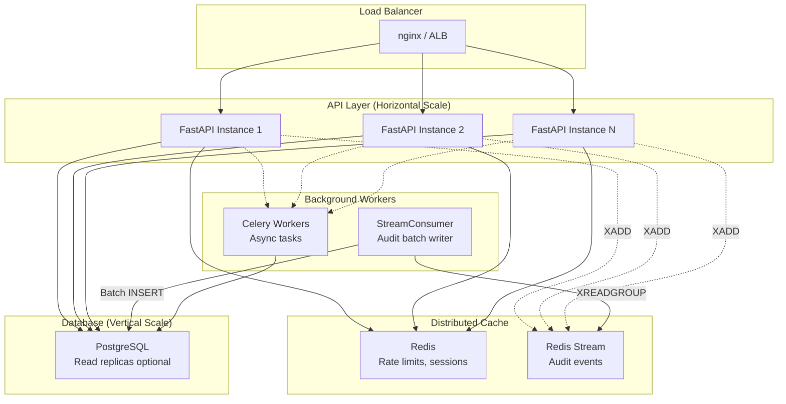

**Audit Pipeline Scalability:**

When `AUDIT_PIPELINE=redis_stream`, audit event persistence is decoupled from request handling. This provides:

- **Reduced request latency**: `XADD` completes in microseconds vs. a full DB round-trip per audit write.
- **Batch efficiency**: The `StreamConsumer` writes up to 50 entries per DB transaction, reducing connection overhead.
- **Horizontal scaling**: Multiple consumer instances can join the `audit-writers` consumer group for parallel processing.
- **Backpressure tolerance**: Redis Streams buffer events during DB slowdowns, preventing audit writes from stalling API responses.
- **Crash recovery**: Unacknowledged messages are automatically reclaimed from failed consumers via `XPENDING` + `XCLAIM`.

### 9.3 Connection Pool Configuration

| Setting | Value | Rationale |
|---------|-------|-----------|
| `pool_size` | 5 | Minimum maintained connections |
| `max_overflow` | 10 | Temporary burst capacity |
| `pool_timeout` | 30s | Max wait for connection |
| `pool_recycle` | 1800s | Prevent stale connections |
| `pool_pre_ping` | true | Validate before use |

---

## 10. Deployment Architecture

### 10.1 Docker Composition

```mermaid
flowchart TB
    subgraph DockerNetwork["Docker Network: agentgate"]
        direction TB

        subgraph Frontend["Frontend Container"]
            Dashboard["Next.js Dashboard<br/>Port 3000"]
        end

        subgraph Backend["Backend Container"]
            Server["FastAPI Server<br/>Port 8000"]
        end

        subgraph Data["Data Containers"]
            Postgres["PostgreSQL<br/>Port 5432"]
            Redis["Redis<br/>Port 6379"]
        end
    end

    subgraph External["External"]
        User["User Browser"]
        Agent["AI Agent SDK"]
    end

    User -->|"HTTPS:443"| Dashboard
    Dashboard -->|"Internal:8000"| Server
    Agent -->|"HTTPS:8000"| Server

    Server --> Postgres
    Server --> Redis

    style DockerNetwork fill:#1e3a5f,stroke:#60a5fa
```

### 10.2 Environment Configuration

| Variable | Development | Production |
|----------|-------------|------------|
| `AGENTGATE_ENV` | `development` | `production` |
| `DATABASE_URL` | `sqlite:///./dev.db` | `postgresql://...` |
| `REDIS_URL` | `memory://` | `redis://redis:6379` |
| `SECRET_KEY` | `dev-secret-key` | 32+ char from Key Vault |
| `ALLOWED_ORIGINS` | `http://localhost:3000` | `https://yourdomain.com` |
| `AUDIT_PIPELINE` | `sync` | `sync` or `redis_stream` |
| `AZURE_KEY_VAULT_URL` | (not set) | `https://your-vault.vault.azure.net` |

### 10.3 Production Checklist

- [ ] Set `AGENTGATE_ENV=production`
- [ ] Configure Azure Key Vault secrets
- [ ] Set `SECRET_KEY` (minimum 32 characters)
- [ ] Configure PostgreSQL with SSL
- [ ] Configure Redis with authentication
- [ ] Set `ALLOWED_ORIGINS` to production domains only
- [ ] Enable HTTPS with valid certificates
- [ ] Configure Prometheus metrics endpoint
- [ ] Set up log aggregation (CloudWatch, Stackdriver)
- [ ] Configure alerting for threat detection events
- [ ] Test audit chain verification
- [ ] Verify PII encryption with test data
- [ ] Load test rate limiting configuration

---

## Appendix A: Exception Hierarchy

```
AgentSafetyError (base)
├── ValidationError
│   └── message, details
├── RateLimitError
│   └── retry_after: float
├── BudgetExceededError
│   └── current_cost, max_budget
├── ApprovalRequired
│   └── tool, inputs, approval_id
├── ApprovalDenied
│   └── tool, denied_by
├── ApprovalTimeout
│   └── tool, timeout
├── TransactionFailed
│   └── failed_step, completed_steps, compensated_steps, traces
└── GuardrailViolationError
    └── policy_id, state, action, constraint
```

---

## Appendix B: Quick Reference

### SDK Usage

```python
from ea_agentgate import Agent
from ea_agentgate.middleware import Validator, RateLimiter, PIIVault, CostTracker

agent = Agent(
    middleware=[
        Validator(block_patterns=["DROP TABLE", "rm -rf"]),
        RateLimiter(max_calls=100, window="1m"),
        PIIVault(redact_inputs=True, rehydrate_outputs=True),
        CostTracker(max_budget=10.00),
    ],
    agent_id="my-agent",
)

@agent.tool(requires_approval=True, cost=0.05)
def send_email(to: str, body: str) -> str:
    # PII in 'to' and 'body' is automatically masked
    return email_service.send(to, body)

result = agent.call("send_email", to="user@example.com", body="Hello!")
```

### API Authentication

```bash
# Login
curl -X POST http://localhost:8000/api/auth/login \
  -H "Content-Type: application/json" \
  -d '{"email": "admin@example.com", "password": "secret"}'

# Use token
curl http://localhost:8000/api/overview \
  -H "Authorization: Bearer <access_token>"
```

### Dashboard Navigation

| Path | Role Required | Description |
|------|---------------|-------------|
| `/` | Any | Overview dashboard |
| `/playground` | Any | Interactive demo |
| `/traces` | Any | Execution history |
| `/approvals` | Approver+ | Approval queue |
| `/costs` | Any | Cost analytics |
| `/audit` | Auditor+ | Audit logs |
| `/pii` | Admin | PII vault |
| `/users` | Admin | User management |
| `/settings` | Admin | System configuration |
| `/security/threats` | Auditor+ | Threat alerts |

---

*This document is maintained as part of the AgentGate repository. For updates, see the project's GitHub page.*

---

**Erick Aleman | AI Architect | AI Engineer | erick@eacognitive.com**
