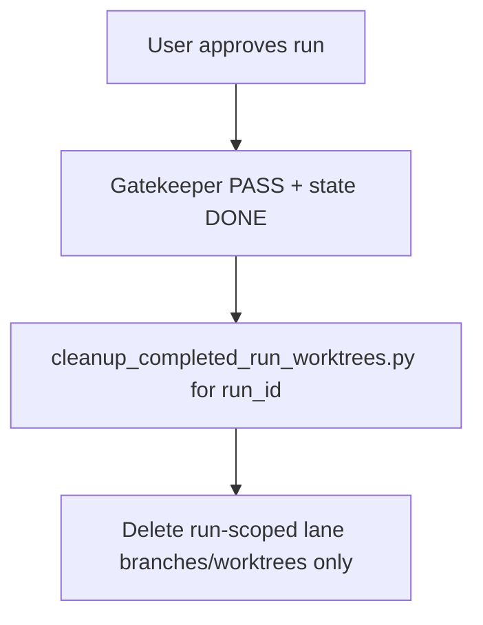

# AgentGate Package Notes

## Principal-Led Run Cleanup

Principal-led cleanup is approval-gated and run-scoped. After the run is approved and reaches
`gatekeeper PASS` with `state DONE`, execute:

```bash
python3 scripts/cleanup_completed_run_worktrees.py \
  --run-dir tests/artifacts/workflow/<run_id> \
  --apply
```

Only worktrees and branches declared for that `run_id` inside `plan_proposal.json lanes` are
eligible for deletion.



Codex app path:

1. Open terminal with `Toggle Terminal` (top-right) or `Cmd+J` on macOS.
2. Optional: right-click run in left sidebar and select `Fork into local`.
3. Run cleanup command with the target `<run_id>`.
